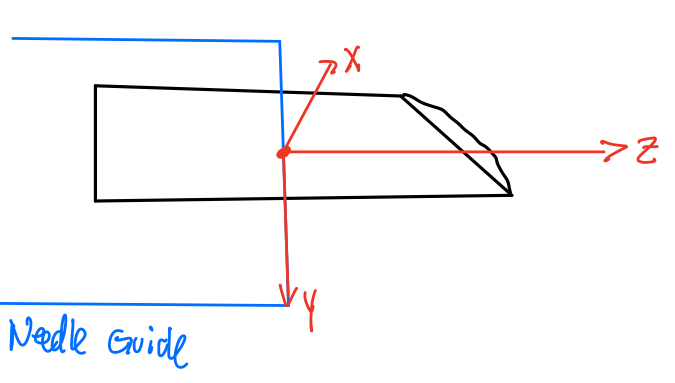

# ROS 2 Needle Shape Publisher
Author: Dimitri Lezcano

This is a repository for publishing the needle shape for the Sensorized Needle Robot project in collaboration with Brigham Women's Hospital.

### Needle Frame Orientation
The needle frame's origin is set to be the end of the insertion needle guide. The orientation of the needle frame is given by



### Dependencies
* MATLAB R2021a
* ROS Toolbox
* Optimization Toolbox
* Needle Shape Publisher Python Package

To install the python dependencies, in your cloned repo, run the command:
```bash
pip install -r ./requirements.txt
```

## Description
NeedleShapePublisher class 
* node of the needle shape publisher

### Parameters
**Needle Parameters**
* needle.paramFile: the sensorized needle configuration parameter file.
* needle.serialNumber: (Read-Only) the needle's serial number that is loaded
* needle.length: (Read-Only) the entire length of the needle 
* needle.channels: (Read-Only) the number of Fiber optic channels embedded in the needle
* needle.activeAreas: (Read-Only) the number of active areas embedded in the needle
* needle.activeAreas.weights: (Read-Only) the reliability weights for each of the needle's active areas
* needle.activeAreas.locations: (Read-Only) the locations (from the tip of the needle) of each of the active areas
* needle.shape_type: (Read-Only, Unused) the configuration of the needle

**Shape Sensing Parameters**
* needle.sensor.numberSignals: How many signals to collect per wavelength update (Default = 200)
* needle.optimizer.initial_kappa_c: The inital $\kappa_c$ guess to start with
 (Default = 0.002)
* needle.optimizer.initial_w_init: The inital $\omega_{init}$ guess to start with (Default = [needle.optimizer.initial_kappa_c; 0; 0])
* needle.optimizer.max_iterations: The maximium number of iterations to reach convergence for shape-sensing (Default = 15) ### Subscribers * /stage/state/needle_pose: "geometry_msgs/msg/PoseStamped" of the needle pose in the jig
* /needle/sensors/processed: "std_msgs/msg/Float64MultiArray" of the sensorized needle's calibrated signal shifts
* /subject/state/entry_point: "std_msgs/msg/PointStamped" the current entry point of the needle in the patient

### Subscribers 
* /stage/state/needle_pose: "geometry_msgs/msg/PoseStamped" of the needle pose in the jig
* /needle/sensors/processed: "std_msgs/msg/Float64MultiArray" of the sensorized needle's calibrated signal shifts
* /subject/state/entry_point: "std_msgs/msg/PointStamped" the current entry point of the needle in the patient

### Publishers
* /needle/state/kappac: "std_msgs/msg/Float64MultiArray" the $\kappa_c$ measurements for all of the layers (currently supported for 2-layer insertions.) for the current shape.
* /needle/state/winit: "std_msgs/msg/Float64MultiArray" a 3D vector of $\omega_{init}$ for the current shape.
* /needle/state/curvatures: "std_msgs/msg/Float64MultiArray" an array of 3D vectors publishing the curvatures measured at each of the active areas.
* /needle/state/current_shape: "geometry_msgs/msg/PoseArray" the pose array of the needle shape in 0.5 mm increments
* /needle/state/predicted: "geometry_msgs/msg/PoseArray" the predicted pose array of the needle shape in 0.5 mm increments (NOT IMPLEMENTED)

## Launch
*\*\* Please note, that the shape-sensing node must have the topic /needle/sensors/processed topic published in order to publish any signals. \*\* *
### Multi-Threaded Shape-Sensing Node
Example of launch the multi-threaded shape sensing needle using launch file
 ```bash
$ ros2 launch needle_shape_publisher       

sensorized_shapesensing_needle_decomposed.launch.py \
needleParamFile:=needle_data/needle_3CH_4AA/needle_params_2021-08-16_Jig-Calibration_weighted_weights.json \
numSignals:=200 optimMaxIterations:=15
```
To launch the files, the arguments to use are:
* needleParamFile: (*Required*) the needle parameter JSON file that describes the sensorized needle. 
* numSignals: (*Optional, Default=200*) the number of signals to gather before publishing curvatures
* optimMaxIterations: (*Optional, Default=15*) the maximum number of optimization iterations. The lower, the faster the needle shape publishing will be, however, this may limit accuracy.

### Single-Threaded Shape-Sensing Node
There is also a single-threaded launch file with the same format as the multi-threaded launch file using the `sensorized_shapesensing_needle.launch.py` file.
